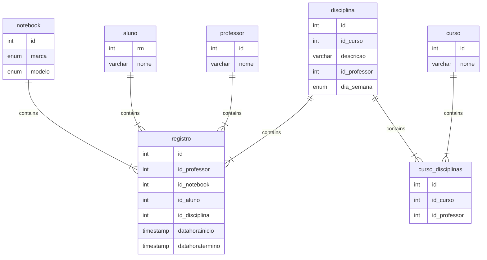

# Controle de Notebooks

Neste projeto iremos criar uma API para 

Value (left)	Value (right)	Meaning
    |o	        o|	            Zero or one
    ||	        ||	            Exactly one
    }o	        o{	            Zero or more (no upper limit)
}|	|{	One or more (no upper limit)

        professor_curso {
            int id
            int id_professor
            int id_curso
        }

